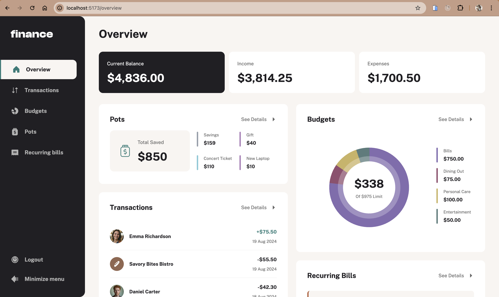

# Personal Finance App with Firebase 💰

This is my solution to the [Personal finance app challenge on Frontend Mentor](https://www.frontendmentor.io/challenges/personal-finance-app-JfjtZgyMt1). Frontend Mentor challenges help you improve your coding skills by building realistic projects. 

## Table of contents

- [Overview](#overview)
  - [Key Features](#key-features)
  - [Screenshot](#screenshot)
  - [Link](#link)
- [My process](#my-process)
  - [Built with](#built-with)
  - [Project Structure](#project-structure)
  - [Installation](#installation)
    - [Prerequisites](#prerequisites)
    - [Steps](#steps)

## Overview

### Key Features

- See all of the personal finance app data at-a-glance on the overview page
- View all transactions on the transactions page with pagination for every ten transactions
- Search, sort, and filter transactions
- Create, read, update, delete (CRUD) budgets and saving pots
- View the latest three transactions for each budget category created
- View progress towards each pot
- Add money to and withdraw money from pots
- View recurring bills and the status of each for the current month
- Search and sort recurring bills
- Receive validation messages if required form fields aren't completed
- Navigate the whole app and perform all actions using only their keyboard
- View the optimal layout for the interface depending on their device's screen size
- See hover and focus states for all interactive elements on the page
- **Bonus**: Save details to a database (build the project as a full-stack app)
- **Bonus**: Create an account and log in (add user authentication to the full-stack app)

### Screenshot



### Link

- Live Site URL: [Personal finance app](#)

## My process

### Built with

- [Tailwind CSS](https://tailwindcss.com/) - For styling
- [React](https://reactjs.org/) - JS library
- [Typescript](https://www.typescriptlang.org/docs/handbook/react.html)
- [Zod](https://zod.dev/) - For request validation
- [Firebase](https://firebase.google.com/) - For authentication and database

### Project Structure

### Installation

#### Prerequisites

- Node.js (v20 or later)
- npm
- Firebase account

#### Steps
1. Clone the repository
```sh
  git clone https://github.com/CrownedTechie/personal-finance-app.git
```

2. Install Dependencies
```sh
  npm install 
```

3. Setup your Environment Variables: 
Create a `.env` file and add:
```#.env
  VITE_API_KEY = your-firebase-api-key
  VITE_AUTH_DOMAIN = your-firebase-auth-domain
  VITE_PROJECT_ID = your-firebase-project-id
  VITE_STORAGE_BUCKET = your-firebase-storage-bucket
  VITE_MESSAGING_SENDER_ID = your-firebase-messaging-sender-id
  VITE_APP_ID = your-firebase-app-id
  VITE_MEASUREMENT_ID = your-firebase-measurement-id
```

4. Run the Development Server
```sh
  npm run dev
```

5. Build for Production
```sh
  npm run build
```

***
Made with 🩷 by Crownedtechie 
Gmail - [nenchi00@gmail.com](mailto:nenchi00@gmail.com)
